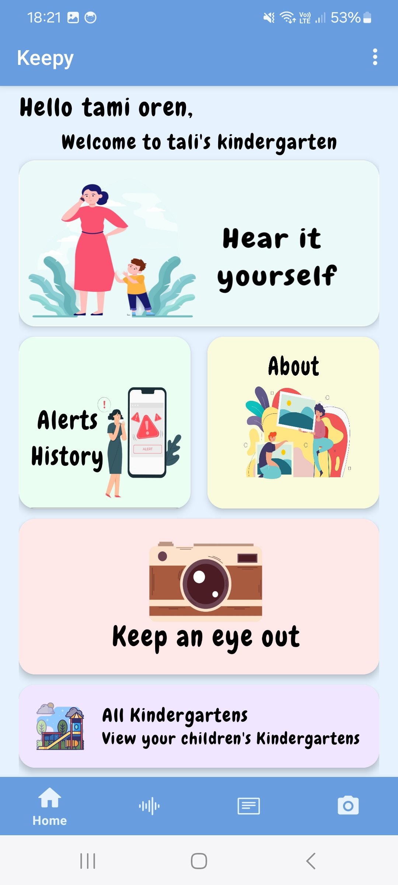
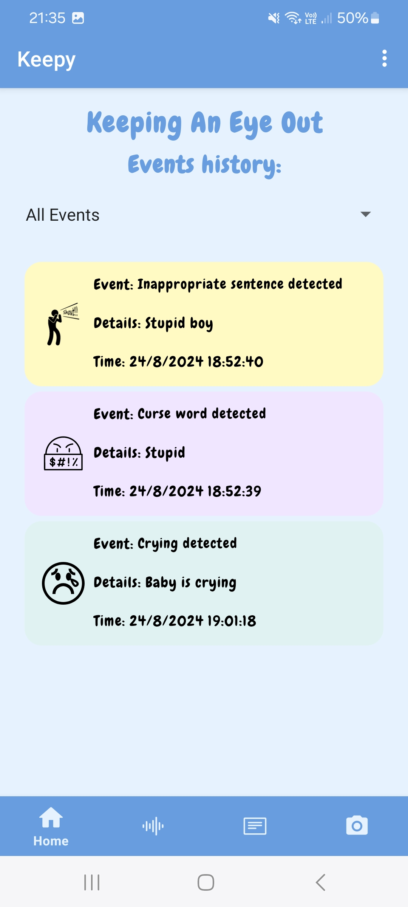
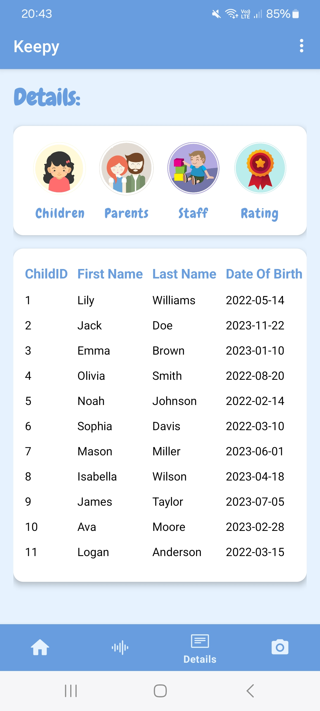

# 🎧 Keepy - Client 🎧

### 📝 Overview
The **Keepy - Client** repository contains the Android application for the **Keepy** system, designed to detect unusual noises in kindergartens and notify parents and teachers in real-time. This app provides a user-friendly interface for receiving alerts, managing kindergarten information, and accessing historical data.

---

## 📱 Application Screenshots

Here are some screenshots from the **Keepy** Android app:


*Home screen where users can view alerts and manage settings.*


*Alerts history with options to listen to recorded audio.*


*Detailed view of children details in the kindergarten.*

---

## 📁 Structure

- **app**: Contains the main Android application code.
- **gradle**: Build configurations for the project.
- **myLibrary**: Custom libraries used within the client application.

---

## 🔧 Installation

### Requirements:
- **Android Studio** or any IDE supporting Android development.
- **Java 11**.

### Steps:
1. Clone the repository:
   ```bash
   git clone https://github.com/itzhakGal/Keepy-Client.git


---


## 📚 Usage

1. Open the app and set up your kindergarten.
2. Receive real-time notifications when anomalies are detected.
3. Access the history of alerts and listen to audio recordings associated with each event.
4. Customize your notification settings to fit your needs.

---

## 💡 Features

- **Real-time Alerts**: Receive push notifications when unusual sounds (crying, shouting, etc.) are detected.
- **Audio Playback**: Listen to recorded audio snippets following an alert.
- **User Settings**: Manage alert preferences and update kindergarten information.
- **History View**: Access previous alerts and corresponding sound clips.
